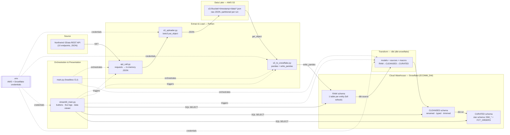

# Ecommerce ELT Pipeline

An end-to-end, cloud-native **ELT** (Extract → Load → Transform) pipeline that
ingests the public **Northwind** ecommerce dataset, lands it in an **AWS S3**
data lake, loads it into a **Snowflake** warehouse, and models it into an
analytics-ready **star schema** with **dbt** — all operable from a **Streamlit**
control panel with live logs and an interactive data viewer.

---

## Architecture at a glance



---

## Components

| # | Component | Technology | Responsibility |
|---|-----------|------------|----------------|
| 1 | **Source API** | Northwind OData v4 REST | 10 endpoints (Customers, Orders, Order_Details, Products, Categories, Suppliers, Employees, Shippers, Regions, Territories) returning JSON under a `value` key |
| 2 | **Extractor** | Python, `requests` | Fetches all endpoints into memory as `{table: json}` — no local files |
| 3 | **Uploader** | Python, `boto3` | Serializes each dataset and `put_object`s it to S3 under a per-run timestamp prefix |
| 4 | **Data Lake** | AWS S3 | Immutable raw JSON, partitioned as `s3://<bucket>/<YYYY-MM-DD_HH-MM-SS>/data/<table>.json` |
| 5 | **Loader** | Python, `pandas`, `snowflake-connector` `write_pandas` | Reads the latest S3 partition, drops OData metadata columns, bulk-loads into Snowflake `RAW` (auto-create + full refresh) |
| 6 | **Warehouse** | Snowflake (`ECOMM_DW`) | Three schemas / medallion layers: `RAW` → `CLEANSED` → `CURATED` |
| 7 | **Transform** | dbt (`dbt-snowflake`) | `CLEANSED`: rename/cast/trim, drop blobs (1:1). `CURATED`: 8 dimensions + `FCT_ORDERS` fact (order-line grain) |
| 8 | **Orchestration** | `main.py` / `dbtRunner` | Runs extract → upload → load → `dbt run` sequentially |
| 9 | **Presentation** | Streamlit | 3 pipeline buttons, live streaming logs, and a RAW/CLEANSED/CURATED data explorer |
| 10 | **Secrets/config** | `.env` + `python-dotenv` | All AWS + Snowflake credentials and settings (git-ignored) |

---

## Data flow (step by step)

1. **Extract** — `api_call.py` GETs the 10 OData endpoints → returns an in-memory dict.
2. **Land** — `s3_uploader.py` writes each dataset to `s3://<bucket>/<timestamp>/data/<table>.json`.
3. **Load** — `s3_to_snowflake.py` picks the latest timestamp folder, reads the JSON, drops `@odata.*` columns, and `write_pandas` → `ECOMM_DW.RAW.<TABLE>` (full refresh).
4. **Transform (staging)** — dbt builds `ECOMM_DW.CLEANSED.<TABLE>` from `source('raw', …)`: snake_case renames, type casts, `trim()`, drop binary blobs.
5. **Transform (marts)** — dbt builds `ECOMM_DW.CURATED` from `ref()` of cleansed models: `DIM_CUSTOMERS/PRODUCTS/EMPLOYEES/CATEGORIES/SUPPLIERS/SHIPPERS/REGIONS/TERRITORIES` + `FCT_ORDERS`.
6. **Serve** — the Streamlit app triggers any stage and queries every layer for inspection.

**Star schema:** `FCT_ORDERS` (grain = order line) joins to `DIM_CUSTOMERS`,
`DIM_EMPLOYEES`, `DIM_PRODUCTS`, `DIM_SHIPPERS`; `DIM_PRODUCTS` → `DIM_CATEGORIES`
/ `DIM_SUPPLIERS`; `DIM_TERRITORIES` → `DIM_REGIONS`.

---

## Tech stack

**Python 3.14** · `requests` · `boto3` · `pandas` · `snowflake-connector-python[pandas]`
· `dbt-snowflake` · `streamlit` · `python-dotenv`
**Cloud:** AWS S3 · Snowflake
**Modeling:** dbt (sources, `ref`, custom `generate_schema_name` macro, medallion layers)

---

## Run it

```bash
python3 -m venv elt_venv
./elt_venv/bin/pip install -r requirements.txt
# create .env (AWS + Snowflake vars) and ~/.dbt/profiles.yml

# Headless
source .env && ./elt_venv/bin/python main.py

# UI
./elt_venv/bin/streamlit run streamlit_main.py   # http://localhost:8501
```

> See `MASTERPLAN.md` for the full, reproduce-from-zero specification.

---

## Architecture-diagram prompt (paste into Claude to generate a visual)

> Create a **left-to-right architecture diagram** for a cloud ELT data pipeline with these
> stages as connected boxes, grouped into labeled zones:
>
> 1. **Source zone** — "Northwind OData REST API (10 JSON endpoints)".
> 2. **Extract & Load zone (Python)** — three boxes: "Extractor (requests)", "S3 Uploader (boto3)",
>    "Loader (pandas + Snowflake write_pandas)".
> 3. **Data Lake zone (AWS S3)** — one box: "Raw JSON, partitioned by run timestamp".
> 4. **Warehouse zone (Snowflake — ECOMM_DW)** — three stacked boxes forming a medallion:
>    "RAW", "CLEANSED", "CURATED (star schema: dimensions + FCT_ORDERS)".
> 5. **Transform zone** — one box: "dbt (dbt-snowflake): sources, ref, macros".
> 6. **Orchestration & Presentation zone** — two boxes: "main.py (CLI)" and
>    "Streamlit UI (buttons, live logs, data viewer)".
>
> Arrows (data flow): API → Extractor → S3 Uploader → S3 → Loader → RAW → (dbt) → CLEANSED → CURATED.
> Dashed control arrows: Streamlit and main.py trigger the Extractor, Loader, and dbt.
> Dashed query arrows: Streamlit reads RAW/CLEANSED/CURATED. A small ".env credentials" node
> feeds the AWS and Snowflake steps. Use a clean, modern, enterprise style with the AWS and
> Snowflake brand-color accents and clearly labeled zones.
```
